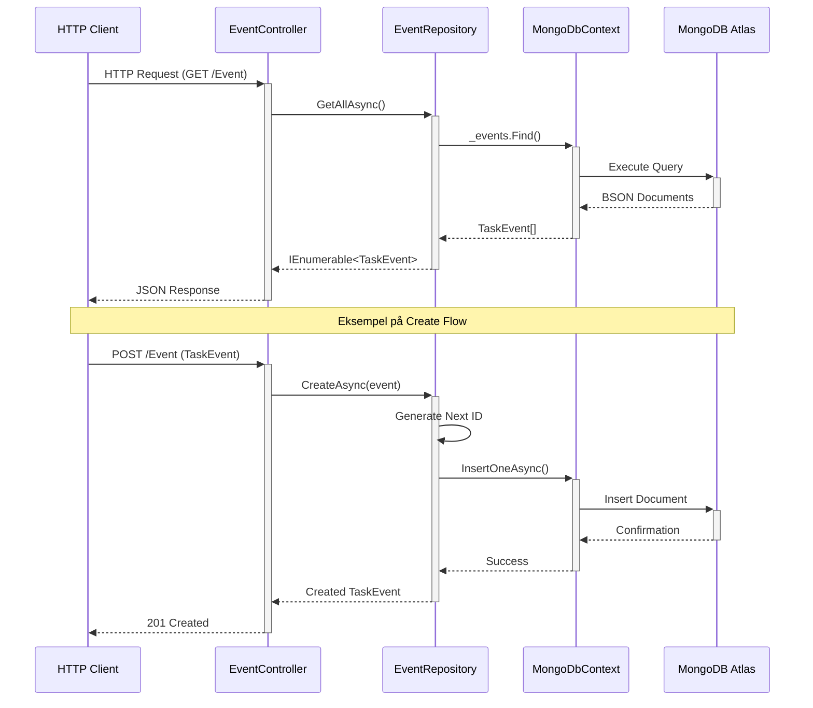

# MadMatrix MongoDB Data Flow

## Detaljeret Flow Beskrivelse

### HTTP Request Flow
1. **Client → Controller**
   - HTTP request modtages af ASP.NET Core
   - Route matching til EventController
   - Model binding af request data

2. **Controller → Repository**
   - Controller validerer input
   - Kalder relevant repository metode
   - Håndterer HTTP status koder

### Database Operations
3. **Repository → MongoDbContext**
   - Repository bygger MongoDB queries
   - Håndterer ID generering
   - Udfører CRUD operationer via context

4. **MongoDbContext → Atlas**
   - Opretholder database forbindelse
   - Konverterer mellem C# og BSON
   - Håndterer connection pooling

### Response Flow
5. **Atlas → Client**
   - Data transformeres gennem lagene
   - Fejlhåndtering på hvert niveau
   - Konvertering til JSON response

## Sikkerhed og Performance
- Alle database kald er asynkrone
- Connection string beskyttet med miljøvariabel
- Automatisk connection pooling
- Retry logic ved netværksfejl
